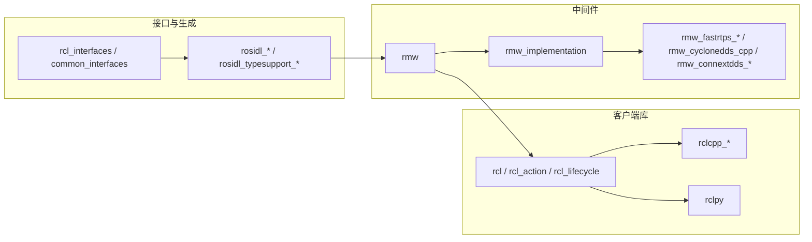

# `ros2_humble/src/ros2` 源码详解

本文仅针对工作区中的 **`ros2_humble/src/ros2/`**：说明该目录下**各 git 仓库的布局、包与源码目录习惯、阅读顺序与模块间关系**。路径均相对于 `ros2_humble/src/ros2/`。工作区其它 `src/ament` 等见 [ros2_humble_src_源码详细解释.md](./ros2_humble_src_源码详细解释.md)；调用栈设计见 [ros2_humble_软件模块源码设计解析.md](./ros2_humble_软件模块源码设计解析.md)。

---

## 1. 总体认识

### 1.1 目录形态

`src/ros2/` 下**每一个一级子目录**（如 `rcl`、`rosidl`）通常对应 **GitHub 上独立仓库** 的克隆根；其内部再含**一个或多个** colcon 包（各包根目录有 **`package.xml`**）。因此：

- 讨论「包名」时以 **`package.xml` 中 `<name>`** 为准（可能与文件夹名略有差异）。
- 讨论「仓库」时以 **`src/ros2/<仓库根>/`** 为准。

### 1.2 功能分层（便于对照源码）

**编译依赖粗顺序**：`rcutils` → `rosidl_*`（生成器与 runtime）→ `rmw` → `rmw_*` 实现 → `rmw_implementation` → `rcl` → `rclcpp` / `rclpy`；之上再叠 `geometry2`、`rviz`、`rosbag2` 等。

---

## 2. 基础设施与工具库

| 仓库目录 | 包 | 源码要点 |
|----------|-----|----------|
| **rcutils** | `rcutils` | C：**分配器**、错误串、`rcutils/types`、日志宏、时间与原子等；几乎被所有下层依赖。 |
| **rcpputils** | `rcpputils` | C++：**`SharedLibrary`**（RMW 动态加载）、环境变量、scope_exit 等。 |
| **rpyutils** | `rpyutils` | Python 小工具，供 rclpy/构建脚本使用。 |
| **各类 `*_vendor`** | 各 vendor 包 | 将 **yaml-cpp、spdlog、tinyxml、libyaml、mimick、pybind11** 等固定版本打进工作区；头文件与库在 build/install 中供依赖包使用。 |
| **eigen3_cmake_module** / **python_cmake_module** | 同名包 | 仅 CMake 模块，无运行时库。 |
| **ament_cmake_ros** | `ament_cmake_ros`、`domain_coordinator` | ROS 包专用 ament_cmake 扩展与域协调相关逻辑。 |
| **console_bridge_vendor** | vendor | 日志桥接依赖。 |
| **orocos_kdl_vendor** | `orocos_kdl_vendor`、`python_orocos_kdl_vendor` | KDL 库 vendor 与 Python 绑定构建。 |
| **performance_test_fixture** | 测试夹具 | 性能基准共用。 |

---

## 3. `rcl/` 仓库 — ROS 客户端库（C）

| 包 | 路径 | 对外 API | 实现源码（核心） |
|----|------|----------|------------------|
| **rcl** | `rcl/rcl` | `include/rcl/*.h` | `src/rcl/*.c`：与 **init、context、node、arguments、remap、graph、wait、pub/sub、service、client、timer、guard_condition、logging** 等一一对应；`*_impl.h` 为内部结构。 |
| **rcl_action** | `rcl/rcl_action` | `include/rcl_action/*.h` | `src/rcl_action/*.c`：Action 在 **多个 rcl client + subscription** 上组合实现。 |
| **rcl_lifecycle** | `rcl/rcl_lifecycle` | 生命周期 C API | 状态机与 transition 相关 `.c`。 |
| **rcl_yaml_param_parser** | `rcl/rcl_yaml_param_parser` | YAML 参数解析 | 供节点启动前装载参数文件。 |

**阅读建议**：从 **`rcl/include/rcl/init.h`、`context.h`、`node.h`** 读契约，再对照 **`src/rcl/init.c`、`context.c`、`node.c`**；发布路径读 **`publisher.c`**（先 `rcl_node_resolve_name` 再 `rmw_create_publisher`）；调度读 **`wait.c`**（`rcl_wait_set_impl_s` 聚合 `rmw_*` 与 timer）。

---

## 4. `rclcpp/` 仓库 — C++ 客户端库

| 包 | 路径 | 内容要点 |
|----|------|----------|
| **rclcpp** | `rclcpp/rclcpp` | **`include/rclcpp/`**：`node.hpp`、`executor.hpp`、`publisher.hpp`、`subscription.hpp`、`qos.hpp`、`parameter.hpp`、`timer.hpp` 等；**`executors/`**（单/多线程 executor）；**`node_interfaces/`**（Node 能力拆分）；**`contexts/`**；**`experimental/`** 实验 API；实现多在 **`src/`** 同名或 `*.cpp`。 |
| **rclcpp_action** | `rclcpp/rclcpp_action` | C++ Action 客户端/服务端封装。 |
| **rclcpp_components** | `rclcpp/rclcpp_components` | **组件节点**：`component_manager`、`NodeFactory` 等，与动态库加载、同进程多节点相关。 |
| **rclcpp_lifecycle** | `rclcpp/rclcpp_lifecycle` | `LifecycleNode` 与 executor 集成。 |

**阅读建议**：**`node.hpp` + `node_interfaces/node_base.hpp`** 看清与 **`rcl_node_t`** 的持有关系；**`executor.hpp` + `executors/*`** 看清与 **`rcl_wait`** 的协作。

---

## 5. `rclpy/` 仓库 — Python 客户端库

| 包 | 路径 | 内容要点 |
|----|------|----------|
| **rclpy** | `rclpy/rclpy` | **`rclpy/`** 下 **`node.py`、`publisher.py`、`subscription.py`、`executors.py`、`context.py`** 等与 rclcpp 概念对齐；**`impl/`** 常为 C 扩展或底层绑定；**`lifecycle/`** 子包对应生命周期。 |

阅读时可与 **`rcl`** 头文件对照：Python API 多为 **rcl C API 的薄封装 + 类型转换**。

---

## 6. `rmw/` 与 `rmw_implementation/`、`rmw_*`

### 6.1 `rmw/rmw`

| 包 | 说明 |
|----|------|
| **rmw** | **`include/rmw/`** 全部为 **C API 声明**（`rmw.h`、`init.h`、`types.h` 等），**无**独立 `.so` 实现；实现由具体 RMW 包提供。 |
| **rmw_implementation_cmake** | CMake 辅助：查找/声明依赖的 RMW 实现。 |

### 6.2 `rmw_implementation/rmw_implementation`

| 包 | 说明 |
|----|------|
| **rmw_implementation** | C++：**运行时加载** `librmw_*`，将 `rmw_create_*` 等调用转发到已加载库；入口逻辑在 **`src/functions.cpp`**（`load_library()`）。 |
| **test_rmw_implementation** | 对「当前加载的 RMW」做一致性测试。 |

### 6.3 `rmw_fastrtps/`、`rmw_cyclonedds/`、`rmw_connextdds/`、`rmw_dds_common/`

| 仓库 | 包 | 说明 |
|------|-----|------|
| **rmw_fastrtps** | **rmw_fastrtps_shared_cpp** | Fast DDS 共用 C++ 实现。 |
| | **rmw_fastrtps_cpp** / **rmw_fastrtps_dynamic_cpp** | 静态类型与动态类型的 RMW 实现入口。 |
| **rmw_cyclonedds** | **rmw_cyclonedds_cpp** | CycloneDDS 实现；仓库内可有 **shared_memory_support.md** 等说明。 |
| **rmw_connextdds** | **rmw_connextdds**、**rmw_connextdds_common**、**rmw_connextddsmicro**、**rti_connext_dds_cmake_module** | Connext 系与 CMake 探测。 |
| **rmw_dds_common** | **rmw_dds_common** | DDS 各实现共享的 **图、发现、工具** C++ 代码。 |

实现源码一般在各包的 **`src/`** 下，文件名常含 **`rmw_*.cpp`**。

---

## 7. `rosidl/` 仓库 — 解析、生成与运行时（核心）

| 包 | 作用 |
|----|------|
| **rosidl_parser** | 解析 IDL。 |
| **rosidl_adapter** | `.msg` 等 → `.idl`。 |
| **rosidl_cmake** | **`rosidl_generate_interfaces`**：串联各 generator 的 **CMake 宏**；`cmake/` 下多脚本。 |
| **rosidl_cli** | 命令行调生成器。 |
| **rosidl_generator_c** / **rosidl_generator_cpp** | 生成 C/C++ 消息体与辅助函数。 |
| **rosidl_runtime_c** / **rosidl_runtime_cpp** | **运行时类型**与 **type_support** 结构体定义。 |
| **rosidl_typesupport_interface** | typesupport 插件接口。 |
| **rosidl_typesupport_introspection_c** / **rosidl_typesupport_introspection_cpp** | 内省式序列化 typesupport 实现与生成物。 |

**阅读建议**：先读 **`rosidl_cmake/cmake/rosidl_generate_interfaces.cmake`** 理解扩展点，再读 **`rosidl_runtime_c/include/rosidl_runtime_c/message_type_support_struct.h`** 理解 rmw 与消息的连接方式。

---

## 8. `rosidl_defaults`、`rosidl_dds`、`rosidl_python`、`rosidl_typesupport`、`rosidl_typesupport_fastrtps`、`rosidl_runtime_py`

| 仓库 | 包 | 作用 |
|------|-----|------|
| **rosidl_defaults** | **rosidl_default_generators**、**rosidl_default_runtime** | 元包：拉齐默认生成器与运行时依赖。 |
| **rosidl_dds** | **rosidl_generator_dds_idl** | 从 rosidl 生成 DDS IDL 相关产物。 |
| **rosidl_python** | **rosidl_generator_py** | 生成 Python 消息模块。 |
| **rosidl_typesupport** | **rosidl_typesupport_c**、**rosidl_typesupport_cpp** | 注册/封装具体 typesupport 实现。 |
| **rosidl_typesupport_fastrtps** | **fastrtps_cmake_module**、**rosidl_typesupport_fastrtps_c**、**rosidl_typesupport_fastrtps_cpp** | 与 Fast DDS 对齐的 typesupport。 |
| **rosidl_runtime_py** | 单包 | 消息在 Python 运行时的工具函数。 |

---

## 9. 标准消息与接口定义

### 9.1 `rcl_interfaces/`

含 **builtin_interfaces**、**rcl_interfaces**、**lifecycle_msgs**、**composition_interfaces**、**rosgraph_msgs**、**statistics_msgs**、**action_msgs**、**test_msgs** 等子包：多为 **`.msg/.srv/.action`** + 生成代码，供参数服务、生命周期、统计、组件加载等使用。

### 9.2 `common_interfaces/`

**geometry_msgs、sensor_msgs、std_msgs、nav_msgs、visualization_msgs** 等各自独立子包；**common_interfaces** 为聚合依赖；**sensor_msgs_py** 提供 Python 侧辅助。

### 9.3 `unique_identifier_msgs`、`test_interface_files`、`example_interfaces`

专用 UUID 消息、测试用接口、教程用最小接口定义。

---

## 10. `launch/` 与 `launch_ros/`

| 仓库 | 包 | 说明 |
|------|-----|------|
| **launch** | **launch**、**launch_xml**、**launch_yaml**、**launch_testing**、**launch_pytest**、**launch_testing_ament_cmake**、**test_launch_testing** | 通用 launch 描述、XML/YAML 前端、与 pytest/ament 的测试集成。 |
| **launch_ros** | **launch_ros**、**ros2launch**、**launch_testing_ros**、**test_launch_ros** | **`Node`/`ComposableNode`**、参数、命名空间等 ROS 实体；**`ros2 launch`** 命令实现。 |

源码主体多为 **Python**（`*.py`），位于各包内 **`launch/`** 或包根约定目录。

---

## 11. `ros2cli/` — `ros2` 命令行

**`ros2cli/ros2cli`** 提供插件发现与子命令分发；**`ros2topic`、`ros2node`、`ros2param`…** 各为独立包，源码通常在 **`ros2<name>/<包名>/<包名>/`** 下的 CLI 实现模块，便于按需依赖、减小安装体积。

---

## 12. `rosbag2/` — 录制与回放

除已在 [ros2_humble_src_源码详细解释.md](./ros2_humble_src_源码详细解释.md) **§3.10「rosbag2」** 列出的包名外，本工作区仓库内还有：

| 包 | 说明 |
|----|------|
| **rosbag2_performance_benchmarking** | `rosbag2_performance/rosbag2_performance_benchmarking`：性能基准。 |
| **rosbag2_storage_evaluation** | 存储后端评估相关（若参与默认构建则随 colcon 图依赖）。 |

架构上：**storage 插件接口**（`rosbag2_storage`）与 **transport 写读路径**（`rosbag2_transport`）分离；**压缩**与 **sqlite/mcap** 以独立包+vend or 形式插入。

---

## 13. `rviz/` — RViz2

**`rviz_common`**：框架与插件 API；**`rviz_rendering`**：渲染；**`rviz_default_plugins`**：默认显示类型；**`rviz2`**：可执行程序；**`*_vendor`**：Ogre、Assimp 等依赖。**测试包**带 `tests` / `visual_testing_framework` 命名。

---

## 14. `geometry2/`、`urdf/`、`message_filters/`

- **geometry2**：**tf2** 核心库、**tf2_ros** 节点封装、**tf2_msgs**、各 **`tf2_*`** 消息适配包及 **tf2_tools**、示例与元包 **geometry2**。  
- **urdf**：**urdf** 解析库、**urdf_parser_plugin** 插件接口。  
- **message_filters**：时间同步与过滤器模板库（常与 TF、感知链配合）。

---

## 15. `ros2_tracing/`、`sros2/`、`system_tests/`、`ros_testing/`

| 仓库 | 说明 |
|------|------|
| **ros2_tracing** | **tracetools** 提供 tracepoint 宏；**ros2trace**、**tracetools_*** 提供采集与 launch 集成；多 **test_*** 包。 |
| **sros2** | **sros2**（CLI 与策略）、**sros2_cmake**（CMake 钩子）。 |
| **system_tests** | 端到端通信、CLI、QoS、安全、rclcpp 等系统级测试包。 |
| **ros_testing** | **ros_testing**、**ros2test**：测试基础设施。 |

---

## 16. `demos/`、`examples/`、`realtime_support/`、`tlsf/`

- **demos**：按功能拆分的**可运行演示**（composition、lifecycle、pendulum、topic_statistics 等），每包通常含 `src/` 与 launch。  
- **examples**：**最小** API 示例，按 **rclcpp / rclpy** 与 topics、services、actions、executors 等子目录组织。  
- **realtime_support**：**rttest**、**tlsf_cpp** 等与实时调度、分配器试验相关。  
- **tlsf**：TLSF 分配器包本体。

---

## 17. 与其它文档的关系

| 文档 | 与本篇关系 |
|------|------------|
| [ros2_humble_src_源码详细解释.md](./ros2_humble_src_源码详细解释.md) | 覆盖 **整个 `src/`**（含 ament、ros），本篇只深挖 **`src/ros2/`**。 |
| [ros2_humble_软件模块源码设计解析.md](./ros2_humble_软件模块源码设计解析.md) | **rcl / rmw / rclcpp / rosidl / rcl_action** 的设计细节与**源码引用**。 |
| [ros2_humble_代码架构说明.md](./ros2_humble_代码架构说明.md) | 分层总览与推荐阅读顺序。 |

---

## 18. 推荐阅读顺序（只读 `src/ros2`）

1. **`rmw/rmw/include/rmw/rmw.h`**（及 mainpage 注释）  
2. **`rcl/rcl`**：`init.c`、`context_impl.h`、`node.c`、`publisher.c`、`wait.c`  
3. **`rclcpp/rclcpp`**：`node.hpp`、`executor.hpp`、`node_interfaces/`  
4. **`rosidl/rosidl_cmake`** + **`rosidl_runtime_c`**  
5. 任选一 **`rmw_fastrtps_cpp`** 或 **`rmw_cyclonedds_cpp`** 中 `rmw_create_node` 等实现  
6. **`ros2cli/ros2cli`** 插件入口，再任选一个子命令包  

---

*若上游在 `src/ros2` 中增删仓库或包，请以各目录下 `package.xml` 的 `<name>` 为准更新本篇表格。*

---

## 19. 从 `src/ros2` 目录反推 ROS 2 整体架构

从当前 `src/ros2` 的仓库拆分方式，可以直接看出 ROS 2 是一个“**接口生成 + 中间件抽象 + 客户端库 + 工具生态**”四层体系，而不是单一通信库：

### 19.1 架构骨架（由目录直接映射）

1. **接口层（Interface Contracts）**  
   `common_interfaces`、`rcl_interfaces`、`example_interfaces`、`unique_identifier_msgs`  
   - 提供跨包复用的 `.msg/.srv/.action` 契约。
   - 上层业务与下层传输通过“消息契约”解耦。

2. **生成与类型支持层（IDL Toolchain）**  
   `rosidl`、`rosidl_defaults`、`rosidl_python`、`rosidl_typesupport`、`rosidl_typesupport_fastrtps`、`rosidl_dds`  
   - 将接口定义编译为 C/C++/Python 类型与 typesupport。
   - 让同一份接口可被多语言与多 RMW 实现消费。

3. **通信抽象层（Middleware Abstraction）**  
   `rmw`、`rmw_implementation`、`rmw_fastrtps`、`rmw_cyclonedds`、`rmw_connextdds`、`rmw_dds_common`  
   - `rmw` 定义统一 API，具体实现由 `rmw_*` 提供。
   - `rmw_implementation` 负责运行时装配（按环境与可用库选择实现）。

4. **客户端运行时层（Client Runtime）**  
   `rcl`、`rclcpp`、`rclpy`、`rcl_logging`、`rcutils`、`rcpputils`  
   - `rcl` 承担 ROS 语义（context、node、wait、参数、重映射等）。
   - `rclcpp/rclpy` 提供用户编程模型（Node/Executor/Callback）。

5. **系统能力与开发者体验层（System Capabilities）**  
   `launch`、`launch_ros`、`ros2cli`、`rosbag2`、`rviz`、`geometry2`、`sros2`、`ros2_tracing`、`system_tests`  
   - 覆盖启动、调试、录包回放、可视化、安全、性能观测、系统验证。
   - 说明 ROS 2 是“可运维的软件平台”，不只是 API 集。

### 19.2 两条主链路（源码视角）

- **构建期主链路**  
  `*.msg/*.srv/*.action` → `rosidl_*` 生成器 → `typesupport` 库 → 编译进 `rclcpp/rclpy` 应用

- **运行期主链路**  
  `rclcpp/rclpy` 节点 → `rcl`（wait/set、graph、参数）→ `rmw` 抽象 → 具体 `rmw_*` → DDS 实现

这两条链路在目录上被清晰拆开：`rosidl*` 负责“编译期类型世界”，`rcl/rmw*` 负责“运行期通信世界”。

### 19.3 目录拆分体现的关键设计原则

- **可替换性**：`rmw_*` 多实现并存，验证“同上层 API 可替换底层 DDS”。  
- **可移植性**：`rcl` 为语言无关 C 层，`rclcpp/rclpy` 只是不同语言外观。  
- **可扩展性**：`ros2cli`、`rviz`、`rosbag2` 都是插件/子包化拆分，便于按需安装。  
- **可验证性**：`system_tests`、`ros_testing`、`test_interface_files` 与 tracing/security 子树长期共存，说明测试不是附属品。  
- **工程化一致性**：大量 `*_vendor` 与 CMake module 显示 ROS 2 对依赖版本与可重复构建的重视。

### 19.4 可执行的架构结论

基于 `src/ros2` 当前目录结构，可将 ROS 2 定义为：

> 一个以 **IDL 契约 + 可替换中间件 + 多语言客户端库 + 完整工具链** 组成的机器人软件平台架构。  
> 其核心不是“某个单独库”，而是“从接口定义到运行运维”的全链路分层系统。
