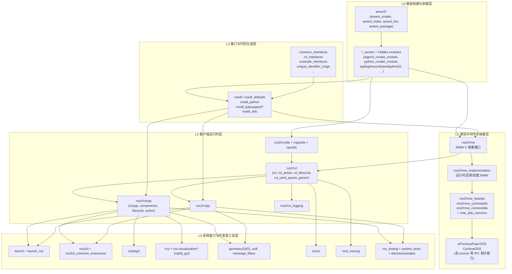

# `ros2_humble/src` 整体架构图（目录反向分析）

本文基于工作区实际目录 `ros2_humble/src` 进行分层抽象，用一张图展示“从构建基础到机器人应用工具链”的整体架构。

---

## 1. 架构总图

---

## 2. 读图说明（简版）

- **L0** 提供构建系统与第三方依赖管理，是整棵源码树的地基。  
- **L1** 把通信“抽象”和“具体 DDS 实现”解耦：上层只依赖 `rmw`，底层可切换实现。  
- **L2** 是开发者常直接接触的客户端运行时：C 层 `rcl` + C++/Python 封装。  
- **L3** 是接口工程化核心：消息/服务/动作定义经 rosidl 生成后接入运行时与中间件。  
- **L4** 是工程落地层：启动、命令行、录包、可视化、安全、追踪、系统测试。  

---

## 3. 结论

从 `src` 目录可以看出，ROS 2 并非单一通信库，而是一个由 **构建系统 + 接口生成 + 中间件抽象 + 多语言运行时 + 完整工具链** 组成的分层机器人软件平台。

