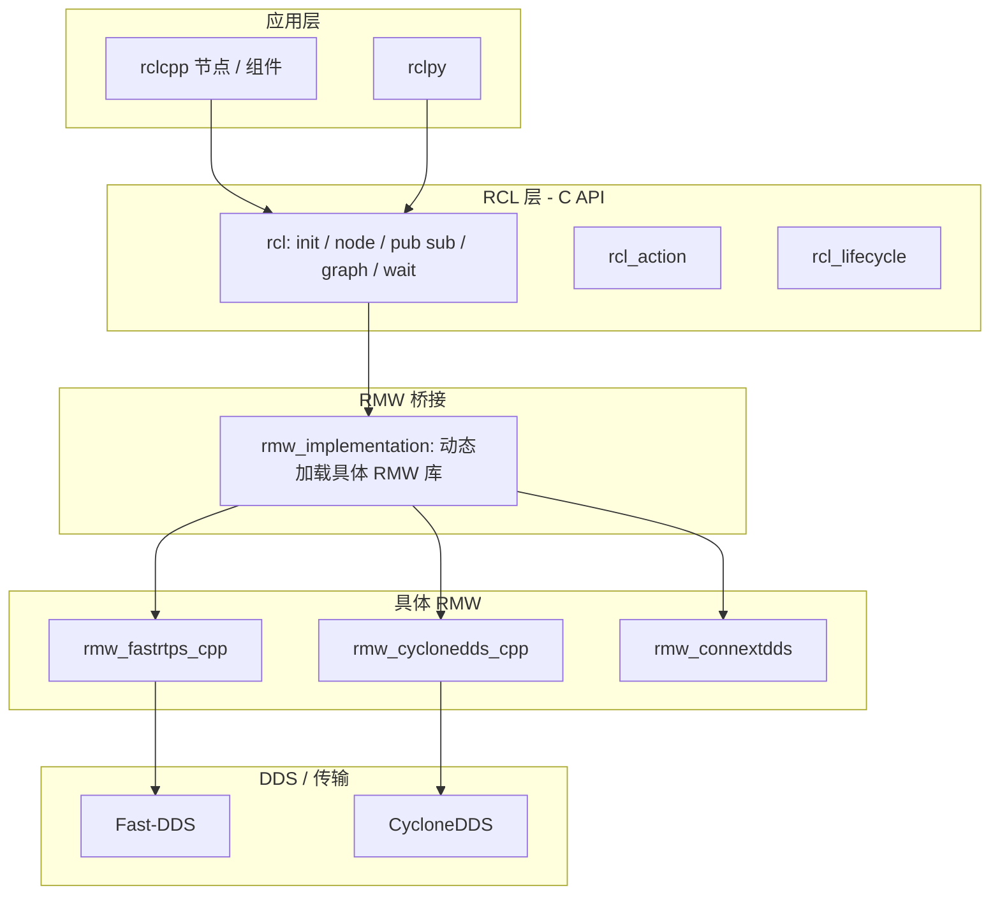

# ROS 2 Humble 代码架构说明（本工作区 `ros2_humble`）

本文档面向在本仓库中阅读 **ROS 2 Humble** 源码的学习路径，描述 `ros2_humble` 工作区的目录组织、运行时分层，以及各层之间的依赖关系。路径均相对于工作区根目录 `ros2_humble/`。

---

## 1. 工作区顶层结构

| 目录 | 作用 |
|------|------|
| `src/` | 所有上游源码（`ament`、`ros2`、DDS、可视化等），由 **colcon** 从此处编译 |
| `build/` | 各包的中间构建产物 |
| `install/` | 安装前缀；`source install/setup.bash` 后使用已编译包 |
| `log/` | colcon 构建日志 |

源码按 **组织/项目** 拆在 `src/` 下，而不是单一 monorepo。本环境中主要包括：

- `src/ros2/` — OSRF 维护的核心 ROS 2 栈（rcl、rclcpp、rosidl、rmw、launch、工具链等）
- `src/ament/` — 构建与元数据（ament_cmake、ament_index、lint 等）
- `src/eProsima/` — Fast-CDR、Fast-DDS 及内存 vendor 等
- `src/eclipse-cyclonedds/` — CycloneDDS
- `src/eclipse-iceoryx/` — iceoryx（零拷贝相关中间件组件）
- `src/ros-visualization/`、`src/ros-planning/` 等 — 可视化与消息扩展

---

## 2. 运行时分层（自顶向下）

ROS 2 客户端库通过 **RCL（ROS Client Library C）** 访问 **RMW（ROS Middleware）** 抽象，再由具体 **RMW 实现** 调用 DDS 或其它传输。

要点：

- **rclcpp / rclpy**：面向用户的 API；内部持有 `rcl_*` 结构并调用 rcl。
- **rcl**：语言无关的 C 库；管理 **context**、**node**、QoS、等待集、图发现等与“ROS 语义”强相关的逻辑。
- **rmw**：纯 C 头文件定义的中间件抽象（`src/ros2/rmw/rmw/include/rmw/`）。
- **rmw_implementation**：在运行时通过 **共享库** 加载选定的 `rmw_*` 实现（见下文）。

---

## 3. `src/ros2` 核心包分组

以下为阅读源码时常用的 mental map（非完整包列表）。

### 3.1 客户端库

| 包 | 路径示例 | 说明 |
|----|-----------|------|
| `rclcpp` | `src/ros2/rclcpp/rclcpp/` | C++ 节点、`Node`、`Executor`、定时器、参数等 |
| `rclpy` | `src/ros2/rclpy/rclpy/` | Python 绑定与节点 API |
| `rcl` | `src/ros2/rcl/rcl/` | C 层：init、context、node、publisher、subscription 等 |
| `rcl_action` | `src/ros2/rcl/rcl_action/` | Action 客户端/服务端的 C API |
| `rcl_lifecycle` | `src/ros2/rcl/rcl_lifecycle/` | 生命周期状态机 |

**Context 示例**：`rcl_context_t` 表示一次 ROS 初始化会话；零初始化、init、shutdown、fini 的流程见 `src/ros2/rcl/rcl/src/rcl/context.c` 与 `rcl/init.h` 文档注释。

### 3.2 中间件抽象与实现

| 包 | 说明 |
|----|------|
| `rmw` | RMW C 接口与类型定义 |
| `rmw_implementation` | 按环境变量/ament 索引选择并 `dlopen` 具体 RMW 库 |
| `rmw_fastrtps_cpp` | Fast-DDS 的 RMW 实现 |
| `rmw_cyclonedds_cpp` | CycloneDDS 的 RMW 实现 |
| `rmw_connextdds` | RTI Connext 的 RMW 实现 |
| `rmw_dds_common` | 多 DDS 实现共用的工具与类型 |

`rmw_implementation` 中的 `load_library()`（`src/ros2/rmw_implementation/rmw_implementation/src/functions.cpp`）说明了选择逻辑摘要：**优先 `RMW_IMPLEMENTATION` 环境变量**，否则按 ament index 中注册的实现回退尝试加载。

### 3.3 接口与代码生成（rosidl）

| 区域 | 说明 |
|------|------|
| `rosidl_*` | `.msg` / `.srv` / `.action` 的生成器、运行时 C/C++ 类型、typesupport |
| `rosidl_typesupport_*` | 为每种 RMW 提供序列化/反序列化绑定 |
| `rosidl_typesupport_fastrtps` | 与 Fast DDS 相关的 typesupport |
| `rosidl_defaults` | 默认生成器组合 |

消息从 `.msg` 到可执行代码的路径：**定义 → rosidl 生成 → typesupport → rmw 发布/订阅**。

### 3.4 基础设施库

| 包 | 说明 |
|----|------|
| `rcutils` | 分配器、字符串、错误状态、原子等 C 工具 |
| `rcpputils` | C++ 工具（如 `SharedLibrary`、环境变量） |
| `rcl_interfaces` | 参数、日志等标准接口消息 |
| `rcl_logging` | 日志后端抽象与 spdlog 等集成 |
| `ament_index_cpp` / `ament_index_python` | 资源与前缀索引（含 RMW 插件注册） |

### 3.5 启动、工具与生态

| 区域 | 说明 |
|------|------|
| `launch` / `launch_ros` | 声明式启动系统 |
| `ros2cli` | `ros2 topic/node/...` 命令行 |
| `rosbag2` | 录制与回放 |
| `geometry2` | TF2 |
| `rviz` | 三维可视化 |
| `demos` / `examples` | 官方示例 |

---

## 4. 构建系统（ament + colcon）

- 每个包根目录有 **`package.xml`**（依赖声明）和通常 **`CMakeLists.txt`** 或 **`setup.py`**（Python 包）。
- **ament_cmake** 扩展了 CMake，统一导出 include、库依赖与测试。
- 工作区根目录常用命令：`colcon build`、`colcon test`；编译结果进入 `build/` 与 `install/`。

`src/ament/` 提供 `ament_package`、`ament_cmake_*`、`ament_lint_*` 等，是 ROS 2 元构建的基础。

---

## 5. 与本工作区 `src` 树相关的第三方栈

| 位置 | 与 ROS 2 的关系 |
|------|------------------|
| `src/eProsima/Fast-DDS` + `Fast-CDR` | 默认/常用 DDS 栈之一；`rmw_fastrtps` 依赖 |
| `src/eclipse-cyclonedds/cyclonedds` | CycloneDDS；`rmw_cyclonedds` 依赖 |
| `src/eclipse-iceoryx/iceoryx` | 高性能进程间通信；与部分零拷贝路径相关 |

这些与 `src/ros2` 中的 `*_vendor` 包一起，构成完整的可编译工作区。

---

## 6. 推荐阅读顺序（针对本仓库）

1. **`rmw/rmw/include/rmw/rmw.h`** 头内 `\mainpage` 注释：中间件原语总览。
2. **`rcl/rcl/include/rcl/init.h`**、**`rcl/context.h`**：进程级生命周期与 context。
3. **`rclcpp/.../node.hpp`**：节点如何组合 `rcl` 与各 `node_interfaces`。
4. **`rmw_implementation/.../functions.cpp`**：`load_library()`：RMW 如何被选中并加载。
5. 任选 **`rmw_fastrtps_cpp`** 或 **`rmw_cyclonedds_cpp`** 中 `rmw_create_*` 系列实现，对照 `rmw.h` 中的声明。

---

## 7. 文档维护说明

- 本文档描述的是 **本工作区** 在 `ros2_humble/src` 下的 **目录与依赖关系**，不替代官方设计文档。
- 若上游同步新增/移除仓库，以 `src/` 实际目录为准，可据此更新各节表格与路径。

## 8. 延伸阅读

- **ROS 为何叫「机器人操作系统」、与 Linux 等有何区别**：[ROS2命名与机器人操作系统含义辨析.md](./ROS2命名与机器人操作系统含义辨析.md)
- **`ros2_humble` 根目录与 `src/` 各组织下包目录逐项说明**：[ros2_humble_源码目录详细说明.md](./ros2_humble_源码目录详细说明.md)
- **`src/` 下 colcon 包级详细解释**（ament、rcl、rosidl、ros2cli、rosbag2、rviz 等）：[ros2_humble_src_源码详细解释.md](./ros2_humble_src_源码详细解释.md)
- **仅 `src/ros2/` 仓库布局与源码阅读路径**：[ros2_humble_src_ros2_源码详解.md](./ros2_humble_src_ros2_源码详解.md)
- 各模块的**源码级设计**（数据结构、调用顺序、扩展点）：[ros2_humble_软件模块源码设计解析.md](./ros2_humble_软件模块源码设计解析.md)
